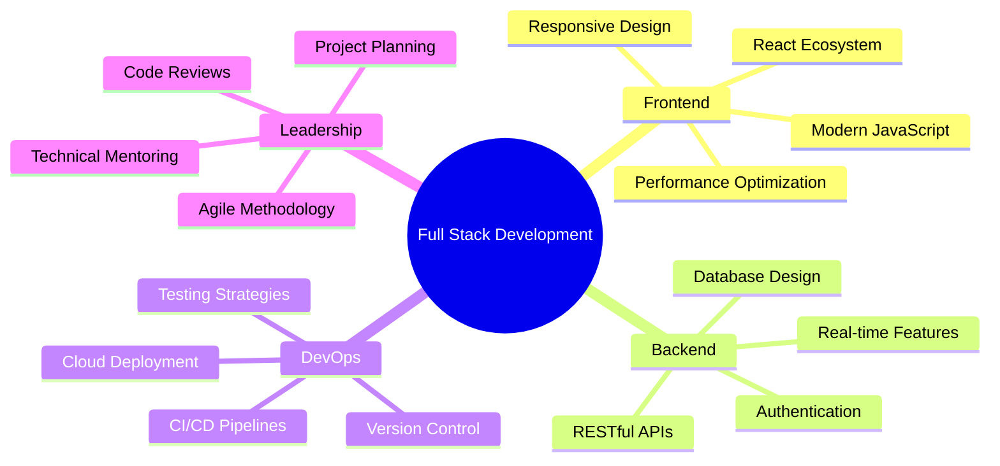

# 👋 Hi there, I'm **Monu Daksh**

<div align="center">
  
  ### 🚀 Full Stack MERN Developer | Building Scalable Web Applications
  
  *Passionate about crafting exceptional digital experiences with modern technologies*
  
  [](mailto:monudaksh009@gmail.com)
  [](https://www.linkedin.com/in/monu-daksh/)
  [](https://monu-daksh.vercel.app/)
  [](https://x.com/monu__daksh)
  
  
  
</div>

---

## 🎯 **About Me**

```javascript
const monuDaksh = {
  role: "Full Stack MERN Developer",
  location: "India 🇮🇳",
  passions: ["Clean Code", "Scalable Architecture", "User Experience"],
  currentFocus: "Building next-generation web applications",
  funFact: "I turn coffee ☕ into code 💻"
};
```

---

## 🛠️ **Tech Arsenal**

<div align="center">

### 🎨 **Frontend Development**


### ⚙️ **Backend Development**


### 🗄️ **Database & Cloud**


### 🔧 **DevOps & Tools**


</div>

---

## 📊 **GitHub Analytics**

<div align="center">
  
  
</div>

<div align="center">
  
</div>

<div align="center">
  
</div>

---

## 🚀 **Featured Projects**

<div align="center">

### 🌟 **Live Applications**

| Project | Description | Tech Stack | Status |
|---------|-------------|------------|--------|
| 🎯 **[Portfolio](https://monu-daksh.vercel.app/)** | Personal portfolio showcasing my work | React, Next.js, TailwindCSS | ✅ Live |
| 🐾 **[My Pet Corner](https://www.mypetcorner.app/)** | Pet care and community platform | MERN Stack, Socket.io | ✅ Live |
| 🛍️ **[Local Posh](https://localposh.com/)** | Local marketplace solution | Next.js, MongoDB, Stripe | ✅ Live |
| 💳 **[Tap Card](https://www.tapcard.co.in/)** | Digital business card platform | React, Node.js, MongoDB | ✅ Live |
| 💎 **Valmira** | E-commerce luxury platform | MERN Stack, Redux | 🚧 In Progress |
| 🛒 **Strishop** | Multi-vendor marketplace | Next.js, TypeScript, AWS | 🚧 In Progress |

</div>

---

## 🏆 **Core Competencies**

<div align="center">



</div>

---

## 📈 **Current Focus**

- 🔥 Building scalable microservices architecture
- 🎨 Exploring advanced React patterns and performance optimization
- 🚀 Implementing CI/CD best practices
- 📱 Diving deeper into mobile-first development
- 🤖 Learning AI integration in web applications

---

## 🎯 **Let's Connect!**

<div align="center">

I'm always excited to collaborate on innovative projects and discuss new opportunities!

**💬 Open to:**
- Freelance projects
- Full-time opportunities
- Technical consultations
- Open source contributions

</div>

---

## ☕ **Support My Work**

<div align="center">

If you find my projects helpful or interesting, consider supporting my work!

[](https://www.buymeacoffee.com/monudaksh)

</div>

---

<div align="center">
  
  ### 💫 *"Code is poetry written in logic"*
  
  **Thanks for visiting! Have a great day! 😊**
  
  
  
</div>
